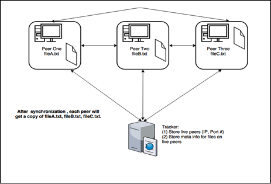

# P2P-File-Synchronizer
Python file synchronizer based on TCP sockets

## Diagram: 

## Instructions:
1. Unzip corresponding tracker zip file
2. Run `tracker.exe <IP> <PORT>`, e.g. `tracker.exe 127.0.0.1 9988`
3. Copy and run fileSynchronizer in directories you would like synchronized. E.g. `Python test1/fileSynchronizer.py 127.0.0.1 9988` and same for other directories
